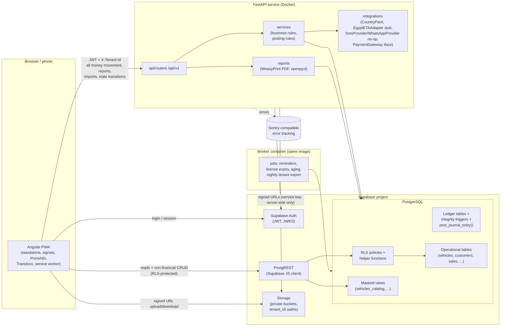
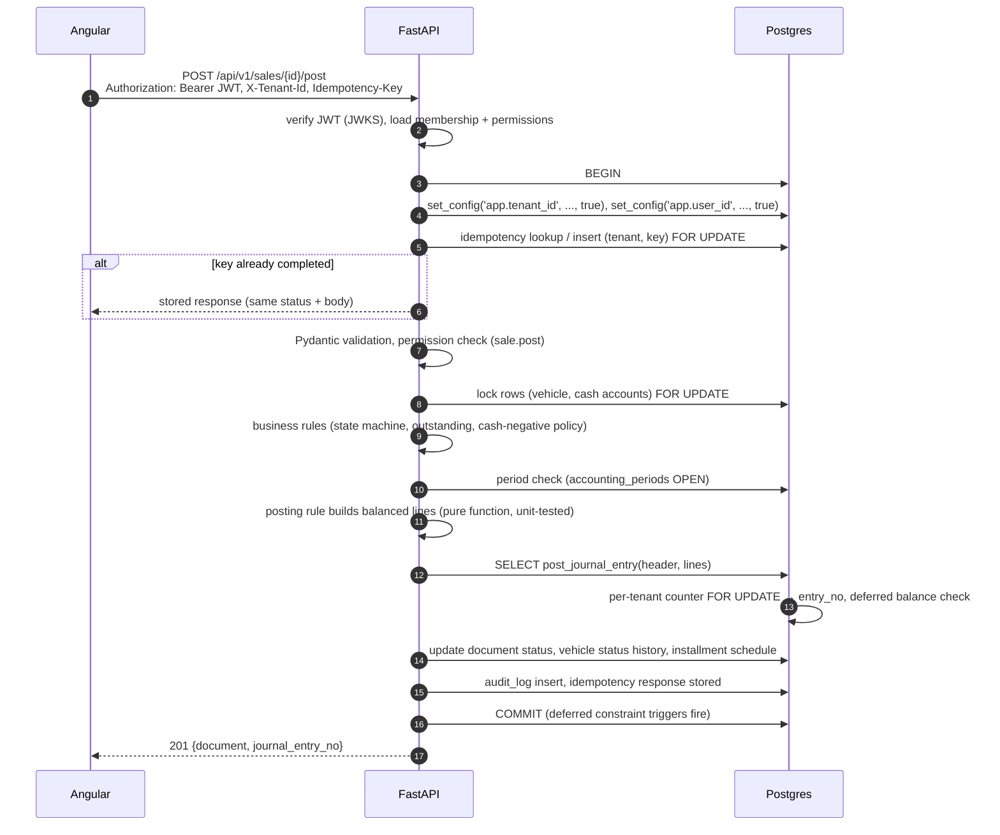

# ARCHITECTURE: SayyaraDMS

> Phase 0 design. Labels: **FACT** / **ASSUMPTION** / **DECISION** / **OPEN QUESTION**. Decisions marked "D-xx" are listed in [DECISIONS.md](DECISIONS.md) and need product-owner approval.

---

## 1. System overview



**FACT (SPEC §2).** The stack is fixed: Angular (latest stable), PrimeNG, `@angular/pwa`, Python 3.12+ with FastAPI and Pydantic v2, and Supabase (Postgres, Auth, Storage, RLS). Migrations are Supabase CLI SQL in `supabase/migrations/`, with **no Alembic**. Server-side PDFs use WeasyPrint, Excel uses openpyxl. Tests use pytest, Angular unit tests and Playwright. CI runs on GitHub Actions, and the API ships as a Docker image.

**DECISION D-01.** The FastAPI database layer is **SQLAlchemy 2.x Core** (typed `Table` objects reflected from, or hand-written to match, the SQL migrations) over **psycopg 3**. There is no ORM unit-of-work magic for financial writes. The spec allowed "SQLAlchemy 2.x (or asyncpg + typed queries)". We pick psycopg 3 because asyncpg's prepared statements conflict with Supabase's transaction-mode pooler (risk R-05).

**DECISION D-02.** The i18n library is **Transloco** (runtime language switching, lazy-loaded scopes per feature).

**DECISION D-03.** Scheduled jobs run in a **separate worker container** built from the API image (`python -m app.jobs`) with APScheduler. Each job takes a Postgres advisory lock, so scaling the API never runs a job twice.

---

## 2. Responsibility split

**FACT (SPEC §3.1).** The browser must **never** insert, update or delete rows in financial tables. Financial tables get `SELECT` policies only for the `authenticated` role.

| Data area | Browser reads via | Browser writes via | Notes |
|---|---|---|---|
| Auth (login, reset, session, MFA) | Supabase Auth | Supabase Auth | FACT |
| Tenant profile, settings, branches, cash accounts, categories, users | Supabase (RLS) | **FastAPI** | DECISION D-04: settings writes go through the API, because they create ledger accounts (cash accounts, expense categories) and need permission checks plus an audit trail |
| Customers, customer requests, follow-ups/call logs | Supabase (RLS) | **Supabase** (RLS) | FACT: non-financial CRUD. Exception: the national ID column is written through the API (D-05) |
| Vehicle master data | Supabase: `vehicles` for cost-permitted roles, `vehicles_catalog` view for everyone else | **FastAPI** | DECISION D-06 (resolves contradiction C-01): the spec lists vehicles as direct CRUD, but the status state machine is backend-enforced, price history must be captured, and the sales role is denied the base table |
| Vehicle media and documents | Supabase (RLS) + signed URLs | Supabase Storage upload + metadata row via Supabase (RLS) | Sensitive document types (purchase contract) are hidden from the sales role (G-09) |
| Purchases, vehicle expenses, sales, reservations, payments, installments, deferred papers, partner transactions, consignment settlements, transfers, general expenses, other income, distributions, reversals, period lock | Supabase (RLS `SELECT` only) | **FastAPI only** | FACT |
| Journal entries and lines | Supabase (RLS `SELECT`, accounting permissions only) | **Only `post_journal_entry()`**, called by FastAPI | FACT |
| Reports (aggregates, PDF, Excel) | **FastAPI** | n/a | FACT. Server-side aggregation and masking |
| Imports | n/a | **FastAPI** | FACT |
| Audit log | Supabase (RLS `SELECT`, `audit.view`) | Triggers and FastAPI (append-only) | FACT |
| Notifications | Supabase (RLS: own rows) | Mark as read via Supabase (RLS column-limited); creation by API and worker | DECISION |

### 2.1 Money-moving request path



**FACT (SPEC §8).** Order: validation → permission → period check → single transaction → posting service → audit log → response containing the journal entry number.

### 2.2 Posting engine split

**DECISION D-07.**

- **Posting rules live in Python** (`app/services/posting/rules.py`). Each rule is a pure function from a typed command to a list of `JournalLine(account_code, debit, credit, subledger…)`. This is where the "tests first" unit tests run (SPEC §0.4).
- **`post_journal_entry(p_header jsonb, p_lines jsonb)`** is a `SECURITY DEFINER` SQL function and the **only** way rows enter `journal_entries` and `journal_lines`. The API's DB role has `EXECUTE` on it but **no** `INSERT` on the ledger tables. The function checks the tenant, the open period, the line shape and the account-to-tenant ownership, assigns `entry_no`, and inserts the rows.
- **`reverse_journal_entry(p_entry_id, p_reason, p_date)`** is the only path that sets `reversed_by_id`.
- DB triggers enforce the invariants a second time (balanced at commit, immutability), so a bypassed Python check still fails (SPEC §7 test).

---

## 3. Database roles and connection model

| Postgres role | Used by | Privileges |
|---|---|---|
| `anon` | Unauthenticated browser | Nothing on tenant tables |
| `authenticated` | Browser through PostgREST | `SELECT` on tenant tables gated by RLS. `INSERT/UPDATE/DELETE` only on non-financial tables (customers, requests, follow-ups, media/document metadata, notification read flags) gated by RLS |
| `app_api` (**DECISION D-08**) | FastAPI and the worker, direct Postgres connection | `SELECT/INSERT/UPDATE` on operational tables; `EXECUTE` on ledger functions; **no** `BYPASSRLS`. RLS policies for `app_api` check `tenant_id = current_setting('app.tenant_id')::uuid`, so a bug that forgets the tenant filter still cannot cross tenants |
| `ledger_owner` | Owns the ledger tables and `SECURITY DEFINER` functions | Not a login role |
| `service_role` | Supabase admin tasks only: Storage signed URLs, Auth admin invites | **Never** used for tenant business queries; **never** shipped to Angular (FACT, SPEC §10) |
| `postgres` | Migrations (CI / Supabase CLI) | Owner |

**DECISION D-09.** Tenant context is set with `set_config('app.tenant_id', $1, true)` (transaction-local), never with session-level `SET`. This stays correct behind Supavisor's transaction pooling. Every API request runs inside one transaction.

---

## 4. Multi-tenancy and RLS

### 4.1 Model

**FACT (SPEC §3.2).** Shared database, shared schema, and `tenant_id uuid not null` on every tenant-owned table.

- `memberships(user_id, tenant_id, role_id, partner_id null, status)` links users to tenants. **DECISION D-10:** the spec wrote `role` as text; we use `role_id → roles`, where `roles` are permission bundles (`role_permissions`). This is what makes "check permissions, not role names" possible in SQL (resolves C-02).
- **DECISION D-11 (cross-tenant references enforced by FKs).** Every tenant table has `UNIQUE (tenant_id, id)`, and every foreign key between tenant tables is **composite**: `(tenant_id, vehicle_id) REFERENCES vehicles (tenant_id, id)`. The database itself rejects a row that references another tenant's data (business rule 8), independently of RLS.

### 4.2 SQL helper functions (schema `private`, not exposed by PostgREST)

| Function | Returns | Purpose |
|---|---|---|
| `private.is_member(p_tenant uuid)` | bool | An active membership exists for `auth.uid()` and the tenant is not deleted |
| `private.has_permission(p_tenant uuid, p_perm text)` | bool | The membership's role grants the permission (replaces the spec's `has_role(tenant, roles[])`; see C-02) |
| `private.has_any_permission(p_tenant uuid, p_perms text[])` | bool | Convenience form of the above |
| `private.my_partner_id(p_tenant uuid)` | uuid | `memberships.partner_id`, for the Partner role's own-statement policy |
| `private.tenant_writable(p_tenant uuid)` | bool | False when the subscription is `suspended` (read-only mode, SPEC §4.16) |
| `private.current_tenant_id()` | uuid | `current_setting('app.tenant_id', true)::uuid` for `app_api` policies |

All helpers are `STABLE SECURITY DEFINER`, use a fixed `search_path`, and are wrapped as `(select private.fn(...))` in policies so Postgres caches the result per statement.

### 4.3 Policy patterns

```sql
-- Pattern A: non-financial table (e.g. customers), browser CRUD
create policy customers_select on customers for select to authenticated
  using ((select private.has_permission(tenant_id, 'customer.view')));
create policy customers_insert on customers for insert to authenticated
  with check ((select private.has_permission(tenant_id, 'customer.manage'))
              and (select private.tenant_writable(tenant_id)));
-- update/delete analogous; "delete" is soft (archived_at) and done through update.

-- Pattern B: financial table (e.g. sales), browser read-only
create policy sales_select on sales for select to authenticated
  using ((select private.has_permission(tenant_id, 'sale.view')));
-- no insert/update/delete policies for authenticated.

-- Pattern C: API role
create policy sales_api on sales for all to app_api
  using (tenant_id = (select private.current_tenant_id()))
  with check (tenant_id = (select private.current_tenant_id()));

-- Pattern D: partner sees own ledger lines only
create policy jl_partner_own on journal_lines for select to authenticated
  using ((select private.has_permission(tenant_id, 'journal.view'))
      or (partner_id is not null
          and partner_id = (select private.my_partner_id(tenant_id))
          and (select private.has_permission(tenant_id, 'partner.view_own'))));
```

> These snippets illustrate the design. They are not migration code.

### 4.4 Tenant resolution in FastAPI

1. The `Authorization: Bearer <JWT>` header is verified against Supabase **JWKS** (cached, with key rotation).
2. The `X-Tenant-Id` header is required on all tenant endpoints. A missing header returns `400 TENANT_HEADER_MISSING`.
3. The API loads the membership and its permission set (cached per request). No membership returns `403 TENANT_ACCESS_DENIED`. This is deliberately the same response as "the tenant does not exist", so tenant ids cannot be probed.
4. The API sets `app.tenant_id` and `app.user_id`, which are used by `app_api` RLS policies and audit triggers.
5. Endpoint dependencies declare permissions: `Depends(require("sale.post"))`.

### 4.5 Isolation tests (FACT, SPEC §3.2)

- **pgTAP:** a user of tenant A, acting as `authenticated` with an A JWT, gets 0 rows from every tenant table for tenant B and cannot insert into B. `app_api` with `app.tenant_id = A` cannot read B. A composite-FK insert that points at B's vehicle fails.
- **pytest (API):** every endpoint is called with A's JWT and `X-Tenant-Id: B` and expects 403. A body that references B's ids with A's header expects 404/422.
- **Generated test:** a script enumerates every table that has `tenant_id` and asserts that RLS is enabled with at least one policy. CI fails otherwise.

---

## 5. Field-level cost masking (sales role)

**FACT (SPEC §10).** The sales role must not receive purchase price, expenses, total cost, minimum price or profit through **any** channel. Three layers enforce this:

| Layer | Mechanism |
|---|---|
| 1. API | Response schemas are chosen per permission: `VehicleOut` (no cost fields) vs `VehicleWithCostOut` (requires `vehicle.view_cost`). Reports, search, notifications and exports apply the same filter. A test asserts that no forbidden key appears in any sales-role response, by walking the JSON |
| 2. Database | `vehicles`, `vehicle_expenses`, `vehicle_purchases`, ledger tables and cost-bearing views are `SELECT`-able only with `vehicle.view_cost` (or the relevant finance permission). Sales users read `vehicles_catalog`, a view **without** cost or minimum-price columns. It runs with owner rights and filters rows by `private.has_permission(tenant_id,'vehicle.view')` (a `security_invoker` view would inherit the base-table denial) |
| 3. UI | Cost tab, cost columns, profit badges and the related Needs Attention alerts are not rendered without the permission. This layer is for usability only; layers 1 and 2 are the actual protection |

Other channels that must not leak cost data (gap G-09):

- Storage documents of type `purchase_contract` and `seller_receipt`.
- Audit log diffs, which require `audit.view`.
- The notification text of "negative profit" alerts. These are generated only for users who hold `vehicle.view_cost`.
- `sales` rows. Profit is never stored on `sales`; it is derived from the ledger.
- Excel and PDF exports.
- Global search results.

---

## 6. Ledger architecture (summary; details in [ERD.md](ERD.md) and [ACCOUNTING.md](ACCOUNTING.md))

**FACT (SPEC §5).**

- Every journal line has exactly one of debit or credit greater than zero.
- Every entry has at least two lines, and Σ debit = Σ credit (a deferred constraint trigger checks this at commit).
- No `UPDATE` or `DELETE` on journal tables, except `reversed_by_id` set through the reversal function.
- Posting dates must fall in an OPEN period.
- `entry_no` is gapless per tenant, from a counter row locked with `FOR UPDATE`.
- Balances are always derived.

**DECISION D-12 (deriving balances).** For MVP volumes (100k lines per tenant), balances come from indexed aggregate queries over `journal_lines` (index on `(tenant_id, ledger_account_id, entry_date)` plus covering subledger indexes). If performance tests in Phase 9 miss the 2-second target, we add an `account_period_balances` summary table that is maintained **inside the posting transaction** by `post_journal_entry`. Nobody can edit it.

**DECISION D-13 (concurrency).**

- Cash-negative checks lock the `cash_accounts` row (`FOR UPDATE`) before computing the balance.
- Vehicle state transitions lock the `vehicles` row.
- The per-tenant `entry_no` counter is locked last and briefly.

This serializes postings per tenant on the counter, which is acceptable for showroom volumes (risk R-04).

---

## 7. Permissions and roles

**DECISION D-14.** Initial permission catalogue and default role bundles. Tenants cannot edit roles in the MVP, but the tables support it.

| Permission | Owner | Manager | Accountant | Sales | Partner | Viewer |
|---|:-:|:-:|:-:|:-:|:-:|:-:|
| `tenant.settings.manage` (profile, branches, cash accounts, categories, tax, profit policy) | ✓ | | | | | |
| `users.manage` | ✓ | | | | | |
| `dashboard.view` (operational) | ✓ | ✓ | ✓ | ✓ (masked) | | ✓ |
| `dashboard.financial` (cash, partner matrix) | ✓ | ✓ | ✓ | | ✓ if setting | Q-05 |
| `vehicle.view` | ✓ | ✓ | ✓ | ✓ | | ✓ |
| `vehicle.manage` (master data, moves, media) | ✓ | ✓ | ✓ | ✓ | | |
| `vehicle.view_cost` (purchase, expenses, cost, profit) | ✓ | ✓ | ✓ | ✗ **never** | | Q-05 |
| `vehicle.view_min_price` | ✓ | Q-05 | ✓ | ✗ **never** | | |
| `vehicle.purchase`, `vehicle.expense.record` | ✓ | ✓ | ✓ | | | |
| `customer.view`, `customer.manage`, `request.manage`, `followup.manage` | ✓ | ✓ | ✓ | ✓ | | view only |
| `customer.view_national_id` (unmasked; audit-logged) | ✓ | ✓ | ✓ | | | |
| `sale.view` | ✓ | ✓ | ✓ | ✓ (own drafts and sold price only) | | ✓ |
| `sale.draft` | ✓ | ✓ | ✓ | ✓ | | |
| `sale.post` (configurable, FACT §4.7) | ✓ | setting | ✓ | | | |
| `sale.cancel` | ✓ | | ✓ | | | |
| `reservation.manage` (take deposit) | ✓ | ✓ | ✓ | Q-05 | | |
| `installment.view`, `installment.collect`, `deferred_paper.manage` | ✓ | ✓ | ✓ | view due list only (Q-05) | | |
| `consignment.manage`, `consignment.settle` | ✓ | ✓ | ✓ | manage only | | |
| `partner.view_all` | ✓ | ✓ | ✓ | | | |
| `partner.view_own` | ✓ | | | | ✓ | |
| `partner.transact` (contributions, drawings, loans) | ✓ | ✓ (if granted) | ✓ | | | |
| `partner.equity.change` (ownership % changes) | ✓ | | | | | |
| `cash.view`, `cash.transact` (expenses, transfers, other income) | ✓ | ✓ | ✓ | | | |
| `supplier.manage`, `supplier.pay` | ✓ | ✓ | ✓ | | | |
| `journal.view` (GL, TB, debit/credit wording) | ✓ | | ✓ | | | |
| `journal.reverse` | ✓ | | ✓ | | | |
| `period.lock` | ✓ | | Q-05 | | | |
| `period.unlock` | ✓ | | | | | |
| `profit.distribute` | ✓ | | | | | |
| `report.financial` | ✓ | ✓ | ✓ | | own statement | Q-05 |
| `import.run` | ✓ | | ✓ | | | |
| `audit.view` | ✓ | | ✓ | | | |
| `support.grant` (grant support access to the platform) | ✓ | | | | | |

Platform permissions (`platform.tenants.manage`, `platform.billing.manage`, `platform.support.access`) belong to `platform_admins` and are separate from tenant roles.

**FACT (SPEC §1.2):** "Manager … finance as granted". **DECISION:** the Manager bundle includes finance permissions by default, and the Owner can toggle `partner.transact` and `sale.post` per tenant through a setting. Full custom roles come later.

---

## 8. Storage

**FACT (SPEC §10).**

- Buckets are private, with short-lived signed URLs.
- Object paths start with `{tenant_id}/`, and storage RLS checks `private.is_member(first path segment)` plus a permission per document type.
- **DECISION D-15.** Bucket layout: `vehicle-media/{tenant_id}/{vehicle_id}/{uuid}.webp`, `documents/{tenant_id}/{entity_type}/{entity_id}/{uuid}.{ext}`, `exports/{tenant_id}/...` (API-written, 24 h signed URLs), `imports/{tenant_id}/{job_id}/source.xlsx`.
- Signed URL expiry: 5 min for viewing, 15 min for uploads.
- Photos are compressed client-side (WebP, longest edge 1600 px, about 80% quality) before upload. FACT: client-side compression is required; the exact numbers are an ASSUMPTION.

---

## 9. Country packs and integrations

**FACT (SPEC §4.14).** `CountryPack` is data-driven per tenant. **DECISION D-16 (shape):**

```text
CountryPack
  code: "EG" | "QA" | ...
  currency: ISO 4217, minor_units (2 for EGP/QAR)
  default_timezone, default_language, default_digit_style
  tax_profile: list of TaxRule (code, rate, applies_to)   ← loaded from DB; EMPTY until Q-11 answered
  invoice_numbering: pattern e.g. "INV-{YYYY}-{seq:05}", reset yearly
  invoice_template: template id (WeasyPrint HTML)
  einvoice_adapter: "egypt_eta_stub" | "none"
  arabic_locale: "ar-EG" | "ar-QA"   (terminology variant, Q-25)
  coa_template: chart-of-accounts seed id
```

Integration interfaces live in `app/integrations/`, and each one ships a no-op or log implementation in the MVP:

- `EgyptETAAdapter`: `submit_document`, `get_status`, `cancel_document`.
- `SmsProvider` and `WhatsAppProvider`: `send(to, template, params)`.
- `PaymentGateway`: `create_checkout`, `verify_webhook`.

---

## 10. Cross-cutting concerns

| Concern | Design |
|---|---|
| **Idempotency** | FACT: every money POST accepts `Idempotency-Key`. DECISION D-17: table `idempotency_keys(tenant_id, key, user_id, endpoint, request_hash, status, response_code, response_body, created_at)`, unique on `(tenant_id, key)`. Same key with a different `request_hash` returns `409 IDEMPOTENCY_KEY_REUSED`. Keys expire after 7 days. Angular generates a UUID per form submission and reuses it on retries |
| **Audit log** | FACT: append-only. Captured by DB triggers (generic `audit_row_change()` on every tenant table, recording before/after JSON) plus API events (login, permission change, national ID view, support access) that carry IP and user agent from the request context. `UPDATE/DELETE` are revoked from all roles, and a trigger raises on any attempt |
| **Errors** | FACT: `{"error": {"code", "message", "details"}}`. No stack traces in production. Codes are listed in [API.md](API.md) |
| **Rounding** | FACT: default `ROUND_HALF_UP` to 2 dp. Banker's rounding is used nowhere, because the spec specifies it nowhere (C-08). One `money.py` helper is used everywhere |
| **Time** | FACT: `timestamptz` in UTC. DECISION D-18: accounting dates (`entry_date`, `sale_date`, `due_date`) are `date` values in the **tenant's timezone**, and the period is derived from `entry_date` |
| **Suspended tenants** | FACT: read-only. Enforced by `private.tenant_writable()` in browser write policies and by an API dependency (`423 TENANT_READ_ONLY`) |
| **Rate limits** | DECISION: per-user and per-IP token bucket (e.g. 120 requests/min, 10 imports/hour), 10 MB maximum request body (25 MB for imports) |
| **Observability** | JSON logs with `request_id`, `tenant_id`, `user_id`; Sentry SDK (DSN optional); `/healthz` (liveness) and `/readyz` (DB check); Prometheus-style `/metrics` (latency, error count, posting count) |
| **Backups** | Supabase PITR/daily backups (plan-dependent) plus a nightly per-tenant logical export (JSON and Excel) to `exports/`. Restore procedure goes in `RUNBOOK.md` (Phase 9) |
| **Data residency** | DECISION D-38: Supabase Cloud Frankfurt for development and the pilot, with no real personal data. Production hosting for Egyptian tenants is pending counsel (Q-21). The stack stays portable (self-hosted Supabase is possible; one deployment per country) |
| **Hosting** | OPEN QUESTION Q-28: where the FastAPI and worker containers run. They must sit in or near the Supabase region |

---

## 11. Repository layout

**FACT (SPEC §12).**

```text
/apps/web            Angular PWA
/apps/api            FastAPI service
  app/api/routers    app/services   app/services/posting   app/domain
  app/db             app/integrations   app/jobs   app/reports
  tests/unit (posting rules)   tests/integration (DB)   tests/api
/supabase            config.toml, migrations/, seed.sql, tests/ (pgTAP)
/docs                SPEC, PRD, ARCHITECTURE, ERD, ACCOUNTING, API, FRONTEND, BACKLOG, DECISIONS, BUSINESS_RULES, RUNBOOK
/.github/workflows   CI: lint, type-check, unit, pgTAP, API tests, migration check, OpenAPI client drift check, E2E
docker-compose.yml   local API + worker (Supabase via CLI)
```
