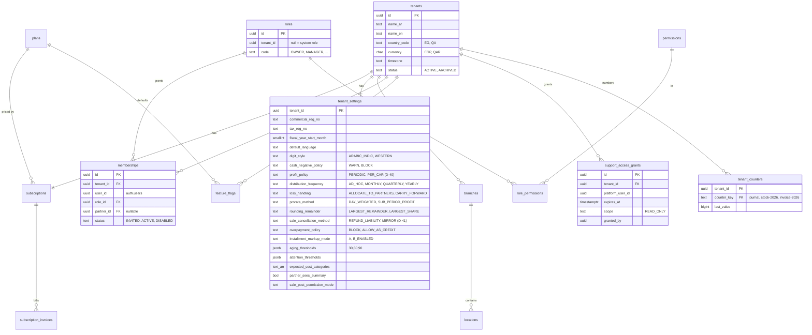
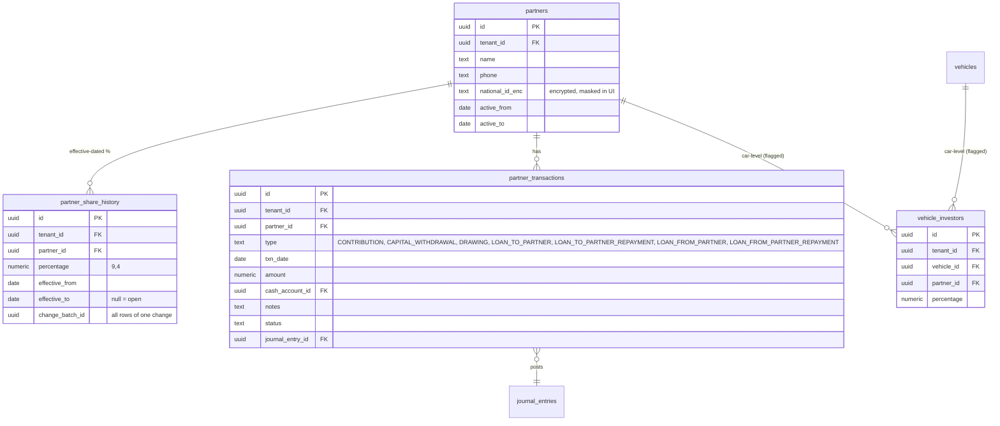
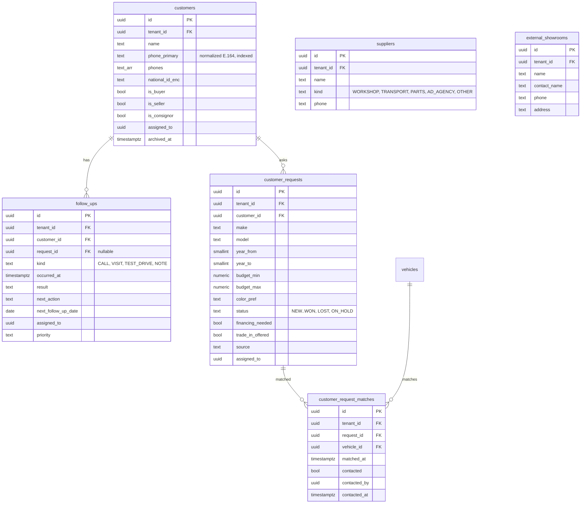
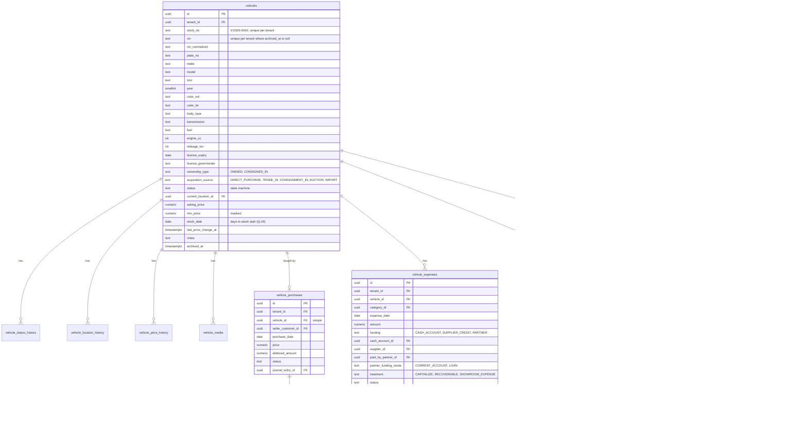
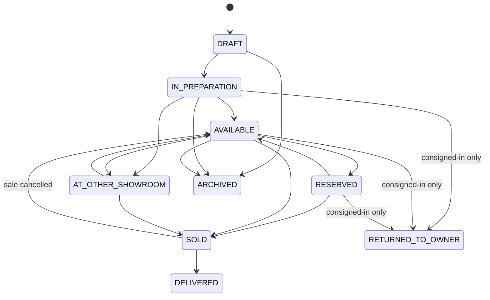
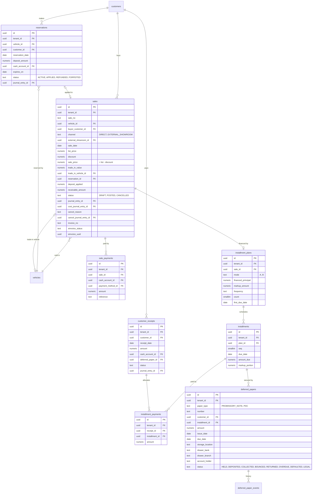
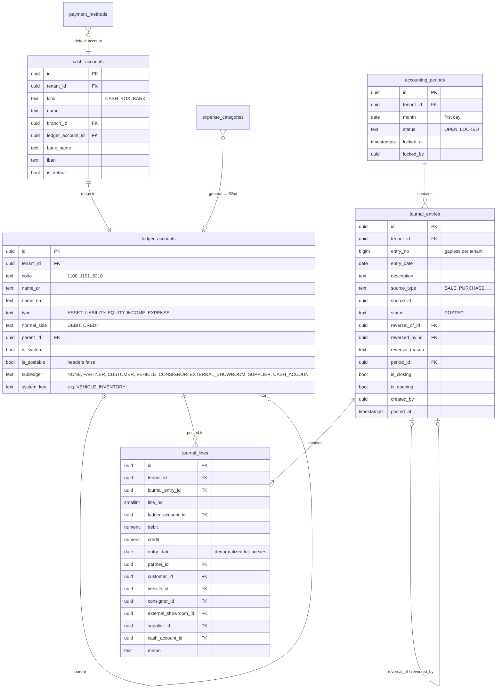

# ERD: SayyaraDMS Database Design

> Phase 0 design. Labels: **FACT** / **ASSUMPTION** / **DECISION** / **OPEN QUESTION** (see [DECISIONS.md](DECISIONS.md)). Table names follow SPEC §5. Every rename or addition is listed in §9.

---

## 1. Global conventions

| Convention | Rule | Label |
|---|---|---|
| Primary keys | `id uuid default gen_random_uuid()` | FACT |
| Tenant column | `tenant_id uuid not null` on every tenant-owned table, with RLS enabled | FACT |
| Tenant-safe FKs | `UNIQUE (tenant_id, id)` on every tenant table; FKs are composite `(tenant_id, x_id) → x(tenant_id, id)` | DECISION D-11 |
| Audit columns | `created_at, created_by, updated_at, updated_by` on every table (journal tables: `created_*` only, since they are immutable) | FACT |
| Money | `numeric(18,2)` with `check (amount >= 0)` unless a sign is meaningful | FACT |
| Percent / quantity | `numeric(9,4)` (but see Q-09, ownership precision) | FACT |
| Soft delete | Master data: `archived_at timestamptz null`. Financial documents: never deleted after posting; drafts can be hard-deleted | FACT |
| Document status | Financial documents: `status in ('DRAFT','POSTED','CANCELLED'/'REVERSED')`, plus `journal_entry_id` once posted | DECISION D-19 |
| Accounting dates | `date` in the tenant's timezone | DECISION D-18 |
| Enumerations | Lifecycle statuses are Postgres `text` + `check` constraints (fixed in code). Configurable lists are reference tables | FACT |

---

## 2. Platform and tenancy

Additional tables:

- `permissions(code PK, description)`
- `role_permissions(role_id, permission_code)`
- `invitations(tenant_id, email/phone, role_id, partner_id, token_hash, expires_at)`
- `platform_admins(user_id PK)`
- `plans(code, limits jsonb)`
- `subscriptions(tenant_id, plan_id, status TRIAL|ACTIVE|PAST_DUE|SUSPENDED, trial_ends_at, current_period_end)`
- `subscription_invoices(manual billing: amount, currency, status, paid_marked_by)`
- `branches(name_ar, name_en, address)`
- `locations(branch_id null, type BRANCH_YARD|OUTDOOR_LOT|WORKSHOP|EXTERNAL_SHOWROOM|CUSTOMER, external_showroom_id null, name)`

**DECISION D-20.** `tenant_counters` is a single table for all gapless or sequential numbers:

- journal `entry_no`
- vehicle stock number `V-{YYYY}-{seq:04}`
- invoice numbers per CountryPack
- receipt numbers

Every number is taken with `SELECT … FOR UPDATE` inside the posting transaction.

---

## 3. Partners

- **FACT.** Share changes are effective-dated and never overwritten.
- **DECISION D-21.** A share change is a **batch**: one `change_batch_id`, all partners' new rows together. A deferred constraint trigger checks at commit that the active percentages sum to 100.0000 for every date touched. This avoids invalid intermediate states (G-04).
- Partner ownership has an exclusion constraint: no overlapping `[effective_from, effective_to)` per partner (`btree_gist`).
- **As built (Phase 3):** `partners` has `name_ar`, `name_en`, `national_id_enc` + `national_id_last4` (D-65) and `archived_at` instead of `active_from/active_to` (activity comes from share history, D-62); `partner_transactions` uses the `posted_document_before_update` trigger; `memberships.partner_id` links a user (D-66); `other_incomes` holds P-01 documents.
- An expense paid personally by a partner (rule 30) is **not** a `partner_transactions` row. It is a `vehicle_expenses`/`general_expenses` row with `paid_by_partner_id` and `partner_funding_mode CURRENT_ACCOUNT|LOAN`.

---

## 4. Customers, suppliers, external showrooms, CRM

- DECISION D-22: the spec's `call_logs` is renamed `follow_ups`, because it also holds visits, test drives and notes.
- DECISION D-23: a `suppliers` table is added (the spec's COA has 2700 "subledger by supplier", but §5 has no table; see C-05).
- Sellers and consignors are `customers` with flags (FACT).

---

## 5. Vehicles and consignment

Other vehicle tables:

- `vehicle_status_history(vehicle_id, from_status, to_status, changed_at, changed_by, reason)`
- `vehicle_location_history(vehicle_id, from_location_id, to_location_id, moved_at, moved_by, reason)`
- `vehicle_price_history(vehicle_id, asking_price, min_price, changed_at, changed_by)`
- `vehicle_media(vehicle_id, storage_path, kind PHOTO, sort_order)`
- `purchase_payments(purchase_id, cash_account_id, payment_method_id, amount)`
- `consignor_settlements(consignment_in_id, kind PAYOUT|RECOVERY, amount, cash_account_id, journal_entry_id)`
- `external_collections(consignment_out_id, external_showroom_id, amount, cash_account_id, journal_entry_id)`

**Status state machine (FACT, SPEC §4.3).** Enforced in the backend service and mirrored by a DB trigger that rejects transitions not in this table:

- **As built (Phase 4):** `vehicle_status_history`, `vehicle_location_history` and `vehicle_price_history` are written by DB triggers (append-only); `vehicle_media` and `documents` hold storage paths only; `vehicle_purchases` also records trade-ins (`source = TRADE_IN`, posted inside the sale entry); `seller_payments` (rule 8) and `supplier_payments` (rule 32) are documents of their own; `vehicle_expenses.treatment` is `CAPITALIZE` or `COGS` (P-04; consigned-car treatments were added in Phase 6, D-93); `locations` is seeded per tenant (showroom, workshop, with customer).
- **ASSUMPTION.** `RESERVED → SOLD` and `AVAILABLE → SOLD` are both allowed (a sale without a prior reservation).
- **OPEN QUESTION Q-30.** Whether `DELIVERED → AVAILABLE` (cancellation after delivery) is allowed. It is not allowed by default.
- **OPEN QUESTION.** Whether a consigned-in car can go to `AT_OTHER_SHOWROOM` (re-consignment). It is not allowed by default.
- **As built (Phase 8):** `import_jobs` (go-live date, sheets with headers/rows/mapping as JSON, validation, result, the opening entry; immutable once COMMITTED) and `import_mappings` (per tenant, kind and header signature). `installment_plans.sale_id` is nullable for imported plans (`opening_reference`, `opening_vehicle`, D-107); `vehicle_purchases.source` adds OPENING with an optional seller (D-108).
- **As built (Phase 7):** `profit_distributions` (range, the options used, net profit, allocated in advance, carried-in loss, distributed, the closing / netting / distribution entries; POSTED → REVERSED only; no two posted ranges overlap) with `profit_distribution_lines` (partner, weight %, amount; immutable); `profit_allocations` (per-car allocation of a sale, POSTED → REVERSED). `journal_entries.is_closing` marks rules 22/23 entries, which alone may be dated inside a distributed range.
- **As built (Phase 6):** `consignments_in` holds one agreement per car (unique on the vehicle) with `terms_type`, `net_price_to_owner` / `commission_value`, `expenses_borne_by` and `shared_owner_pct`, status ACTIVE → SOLD / RETURNED; `consignor_settlements` (PAYOUT rule 17, RECOVERY P-06) and `external_collections` are posted documents (POSTED → REVERSED only). Collections belong to the **showroom**, not to one car (D-95). `consignments_out` allows one open row per car; a sale by the showroom is a `sales` row with `channel = EXTERNAL_SHOWROOM`, `external_showroom_id`, `external_commission` and `commission_journal_entry_id`, and no buyer or invoice. `vehicle_expenses.treatment` adds RECOVERABLE, SHOWROOM and SHARED (D-93). `journal_lines.consignor_id` and `external_showroom_id` now have foreign keys. `follow_ups` is append-only (trigger); `customer_request_matches` is filled by the `vehicles_available_match` trigger (D-97). A RESERVED consigned car is not returned to its owner until its deposit is settled.

---

## 6. Sales, installments and deferred papers

- **FACT.** Installment remaining is **derived**: `amount_due − Σ installment_payments`. There is no `paid_amount` column (business rule 4). A view `v_installment_status` gives `paid`, `remaining`, `days_late` and `state`.
- **DECISION D-24.** The spec's `promissory_notes` table is renamed `deferred_papers`, because it covers notes and post-dated cheques (FACT, SPEC §4.8). Status changes are logged in `deferred_paper_events`.
- **DECISION.** A sale by an external showroom (rule 18) is a `sales` row with `channel = EXTERNAL_SHOWROOM`. There is one sales table and one "sold once" rule.
- **DECISION.** `OVERDUE` is derived (due date passed and remaining > 0) and **not** stored as a paper status, because a stored value would go stale. The stored statuses are the physical states. FACT: the spec lists "overdue" as a status; this is a deliberate deviation (C-10).

Partial unique index: `unique (tenant_id, vehicle_id) where status = 'POSTED'` on `sales` (business rule 1).

**As built (Phase 5):** `installment_plans` (one per sale, status ACTIVE/CANCELLED) and `installments` are immutable once created; `customer_receipts` belong to one plan (`source` CASH_ACCOUNT / CREDIT / PAPER, `excess_to_credit`, status POSTED / REVERSED / BOUNCED); `installment_payments` are the allocations; the `installment_status` view derives paid and remaining; `deferred_papers` (status machine in the database, `receipt_id` of the collection) and `deferred_paper_events` are append-only; `sales.receivable_amount` and `sales.installment_plan` (draft JSON). `notifications` (dedupe key per user) and `reminder_jobs` (per tenant per day) are in §8.

**As built (Phase 4):** `sales` also stores `sale_no`, the trade-in details as JSON until posting (`trade_in`), `cancellation_method` and both cancellation entries; `sale_payments.line_no` keeps the order of payment lines; `reservations.status` adds `RELEASED` (D-72); `customer_refunds` holds refunds of customer credit (P-02); `customers` has `national_id_last4` and E.164 `phone_primary` (D-68). `receivable_amount`, installments and deferred papers arrive in Phase 5.

---

## 7. Cash, expenses and ledger

Other tables:

- `expense_categories(kind VEHICLE|GENERAL, name_ar, name_en, ledger_account_id null, is_seeded, archived_at)`
- `payment_methods(code, name, cash_account_id)`
- `general_expenses(category_id, date, amount, funding, cash_account_id|supplier_id|paid_by_partner_id, journal_entry_id)`
- `other_incomes(date, amount, description, cash_account_id, journal_entry_id)`
- `transfers(date, from_cash_account_id, to_cash_account_id, amount, journal_entry_id)`
- `supplier_payments(supplier_id, date, amount, cash_account_id, journal_entry_id)`
- `bank_reconciliations`, `bank_statement_lines` (placeholders only, FACT §4.10)

### 7.1 Ledger integrity in the database (FACT, SPEC §5)

| Invariant | Mechanism |
|---|---|
| One side per line | `check ((debit > 0 and credit = 0) or (credit > 0 and debit = 0))` |
| Balanced, ≥ 2 lines | `CONSTRAINT TRIGGER … DEFERRABLE INITIALLY DEFERRED` on `journal_lines` insert, which checks the entry at commit |
| Immutable | `BEFORE UPDATE OR DELETE` triggers raise, except an update that changes **only** `reversed_by_id` from null, made while the `app.allow_reversal_link` setting is set by `reverse_journal_entry()` |
| Open period | `post_journal_entry` and a `BEFORE INSERT` trigger on `journal_entries` both check `accounting_periods` (a missing period row is auto-created as OPEN; D-25) |
| Gapless `entry_no` | `tenant_counters` row `FOR UPDATE`; `unique (tenant_id, entry_no)` |
| Sole entry point | No `INSERT` grant on journal tables for `app_api`/`authenticated`; only `post_journal_entry` (`SECURITY DEFINER`) |
| Account belongs to tenant | Composite FK `(tenant_id, ledger_account_id)` |
| Subledger required | Trigger: if `ledger_accounts.subledger = 'PARTNER'`, then `partner_id` is not null (same for each subledger type) |
| Postable only | Trigger: header accounts (`is_postable = false`) are rejected |

---

## 8. Distribution, imports, notifications, audit, documents, idempotency

| Table | Key columns | Notes |
|---|---|---|
| `profit_distributions` | `period_from, period_to, policy, net_profit, status DRAFT/POSTED, closing_entry_id, distribution_entry_id` | Preview is computed live, not stored; posting writes both entries |
| `profit_distribution_lines` | `distribution_id, partner_id, weighted_pct, amount` | Σ amount = net_profit (rounding: Q-18) |
| `import_jobs` | `kind VEHICLES/CUSTOMERS/PARTNERS/INSTALLMENTS, storage_path, status UPLOADED/MAPPED/VALIDATED/COMMITTED/FAILED, go_live_date, stats jsonb, opening_entry_id` | |
| `import_mappings` | `tenant_id, kind, name, column_map jsonb` | Remembered per tenant (FACT) |
| `import_job_rows` | `job_id, row_no, raw jsonb, normalized jsonb, errors jsonb, status` | Drives the validation preview |
| `notifications` | `user_id, kind, title_key, params jsonb, entity_type, entity_id, read_at, dedupe_key` | `unique(tenant_id, user_id, dedupe_key)` avoids duplicate daily alerts |
| `reminder_jobs` | `job_name, run_date, status, started_at, finished_at, stats` | One row per job run; `unique(job_name, run_date)` |
| `audit_log` | `id bigserial, tenant_id null, actor_user_id, actor_kind USER/PLATFORM/SYSTEM, action, entity_type, entity_id, before jsonb, after jsonb, ip inet, user_agent, request_id, occurred_at` | Append-only; partitioned by month (DECISION) |
| `documents` | `entity_type, entity_id, doc_type, storage_path, file_name, mime, size, sensitivity NORMAL/COST` | `sensitivity = COST` is hidden from sales (G-09). Replaces `vehicle_documents` (DECISION) |
| `idempotency_keys` | see ARCHITECTURE §10 | Added (G-06) |
| `support_grants` | `tenant_id, granted_by, reason, starts_at, expires_at (≤ 72 h), revoked_at` | Phase 9 (D-117); the planned `support_access_grants` |
| `invoices` | `tenant_id, period_start, period_end, amount, currency_code, status ISSUED/PAID/VOID, paid_at, reference, marked_by` | Phase 9 manual billing (D-116); the planned `subscription_invoices` |
| `country_packs.terminology` | `jsonb` translation key → country wording | Phase 9 (D-121, Q-25) |

---

## 9. Changes against SPEC §5 (all need approval)

| Spec name | Our design | Reason |
|---|---|---|
| `memberships.role` (text) | `role_id` → `roles` + `role_permissions` + `permissions` | Permission-based auth in SQL (C-02) |
| `call_logs` | `follow_ups` | Covers calls, visits, test drives, notes |
| `promissory_notes` | `deferred_papers` (+ `deferred_paper_events`) | Notes **and** PDCs |
| `vehicle_documents` | generic `documents` with `sensitivity` | One attachment mechanism |
| `sale_payments` | kept; plus `purchase_payments` | Split payments on purchases |
| `installment_payments` | kept, as allocations of `customer_receipts` | One receipt can pay several installments |
| (none) | added `suppliers`, `supplier_payments`, `supplier_id` on `journal_lines` | COA 2700 needs it (C-05) |
| (none) | added `vehicle_purchases`, `vehicle_location_history`, `vehicle_price_history`, `locations` | Required by §4.3 |
| (none) | added `consignor_settlements`, `external_collections`, `reservations.status` | Required by §4.4/§4.5 |
| (none) | added `tenant_counters`, `idempotency_keys`, `support_access_grants`, `invitations`, `subscription_invoices`, `import_job_rows`, `platform_admins`, `payment_methods`, `expense_categories` | Implied by spec text, missing from §5 |
| (none) | added `journal_lines.entry_date` (denormalized) | Date-range indexes on lines without a join |
| (none) | Phase 2: `coa_template` (reference chart copied into each tenant), `tenant_counters` key `journal_entry` | Seeding by trigger; gapless numbers |
| `idempotency_keys` (ARCHITECTURE §10) | stores the final response only, written in the operation's transaction (no IN_PROGRESS row) | A failed operation leaves no key, so retries run again |

---

## 10. Important indexes

**FACT (SPEC §11):** `tenant_id` plus common filters; journal lines indexed by account, partner, vehicle, customer and date.

| Table | Index | Serves |
|---|---|---|
| all tenant tables | `unique (tenant_id, id)` | Composite FKs |
| `vehicles` | `unique (tenant_id, vin_normalized) where archived_at is null` | VIN uniqueness (FACT) |
| `vehicles` | `unique (tenant_id, stock_no)` | |
| `vehicles` | `(tenant_id, status, stock_date)` | Inventory list, aging |
| `vehicles` | `(tenant_id, make, model, year)` | Filters, request matching |
| `vehicles` | trigram GIN on `vin_normalized`, `plate_no`; `(tenant_id, right(vin_normalized, 6))` | Quick search by last digits |
| `customers` | `(tenant_id, phone_primary)`; trigram GIN on `name`, `phones` | Phone-first search |
| `journal_lines` | `(tenant_id, ledger_account_id, entry_date)` include `(debit, credit)` | Balances, cash book, TB |
| `journal_lines` | `(tenant_id, partner_id, entry_date) where partner_id is not null` | Partner statement |
| `journal_lines` | `(tenant_id, vehicle_id) where vehicle_id is not null` | Vehicle cost/profit |
| `journal_lines` | `(tenant_id, customer_id, entry_date) where customer_id is not null` | Customer balances |
| `journal_lines` | `(tenant_id, cash_account_id, entry_date) where cash_account_id is not null` | Cash/bank book |
| `journal_lines` | partial indexes for `consignor_id`, `external_showroom_id`, `supplier_id` | Statements |
| `journal_entries` | `unique (tenant_id, entry_no)`; `(tenant_id, entry_date)`; `(tenant_id, source_type, source_id)` | |
| `installments` | `(tenant_id, due_date)` | Due/overdue board, reminder job |
| `deferred_papers` | `(tenant_id, status, due_date)`; `unique (tenant_id, paper_type, number, drawer_bank)` | Register |
| `sales` | `unique (tenant_id, vehicle_id) where status = 'POSTED'`; `(tenant_id, sale_date)` | Rule 1, reports |
| `customer_requests` | `(tenant_id, status, make, model)` | Matching |
| `follow_ups` | `(tenant_id, assigned_to, next_follow_up_date)` | "Follow-ups due today" |
| `partner_share_history` | GiST exclusion `(tenant_id, partner_id, daterange(effective_from, effective_to))` | No overlaps |
| `memberships` | `unique (tenant_id, user_id)`; `(user_id)` | RLS helper lookups |
| `audit_log` | `(tenant_id, occurred_at desc)`; `(tenant_id, entity_type, entity_id)` | Viewer |
| `notifications` | `(tenant_id, user_id, read_at)` | Bell counter |

**ASSUMPTION.** With these indexes and 100k lines per tenant, aggregate balance queries stay well under 100 ms. This is verified in the Phase 9 performance tests (D-12).
